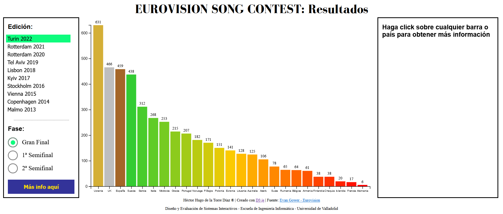
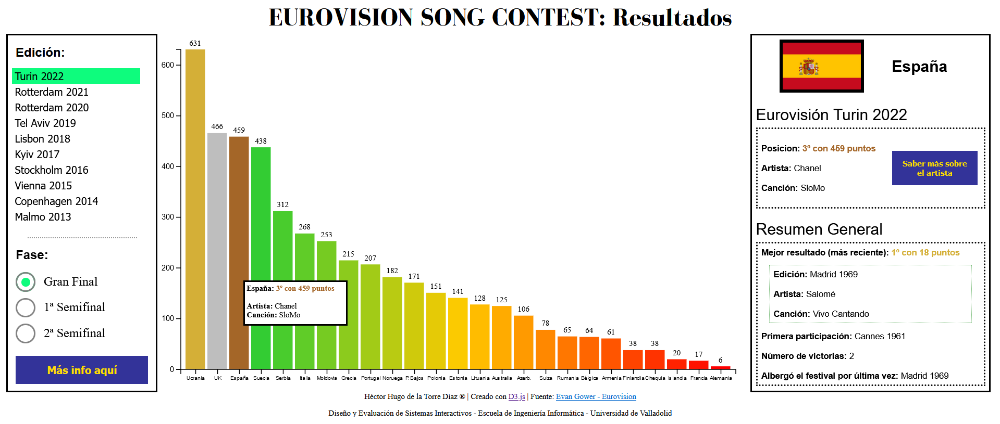

# Eurovision Song Contest: Resultados - [Visualización](https://desi_22-23.pages.gitlab.inf.uva.es/eurovision)

## Resultados del concurso de Eurovisión
Eurovisión, cuyo nombre completo es Festival de la Canción de Eurovisión (Eurovision Song Contest) es un concurso musical anual a nivel europeo iniciado en el 1956, que continúa realizándose a día de hoy. España lleva participando en él de manera ininterrumpida desde su debut en 1961.

En esta visualización se permite analizar los resultados del concurso año por año, así como por fases (a partir de 2003 se crearon las semifinales). Además, permite conocer más a fondo detalles de cada país de su paso por el concurso, como número de victorias, último mejor resultado, última vez que dicho país albergo el festival...

## Datos
Para la visualización, se han utilizado los datos correspondientes al dataset: [Dataset Eurovisión](https://www.kaggle.com/datasets/evangower/eurovision-song-contest) de libre disposición en [Kaggle](https://www.kaggle.com/). Último acceso: 2 de noviembre de 2022.

Se han eliminado algunas variables y procesado los datos, resultando en el dataset con los datos procesados [Dataset del proyecto](./datos.csv).

## Visualización
La visualización se divide en tres secciones.

##### Visualización: Estado inicial

En la primera sección (izquierda) se permite seleccionar tanto la edición como una fase de las existentes en dicha edición para visualizar los respectivos resultados. Además, cuenta con un botón ("Más info aquí") que enlaza con la página web del concurso en ese año.

En la segunda sección (central), se muestra un gráfico de barras con los resultados de la edición y fase seleccionados en la primera sección, con los países ordenados según su puntuación obtenida (ranking). Se utiliza una paleta de colores personalizada: oro para el 1er país, plata para el 2º, bronce para el 3º. Para los demás países, se colorean las barras con un degradado de verde-naranja-rojo. El usuario podrá hacer click en la barra (o etiqueta del país) para conocer más información del país en el concurso. Asimismo, al pasar el cursos por encima de cualquier barra, se informa al usuario de la posición y puntuación obtenida, el artista y canción asociado a dicha barra.

##### Visualización: Se ha hecho click en la barra color bronce (España)

En la tercera sección (derecha), se encuentran dos subsecciones. En la cabecera, la bandera del país junto a su nombre. La primera subsección, informa sobre la participación de dicho país en detalle para la edición y fase seleccionada. Se añade un botón ("Saber más sobre el artista") que enlaza con la página web del artista en eurovision.tv. La segunda subsección, resumen general, muestra los datos claves de ese país desde su debut en Eurovisión: último mejor resultado (detallado), primera participación, número de victorias y cuando albergó el festival por última vez.

